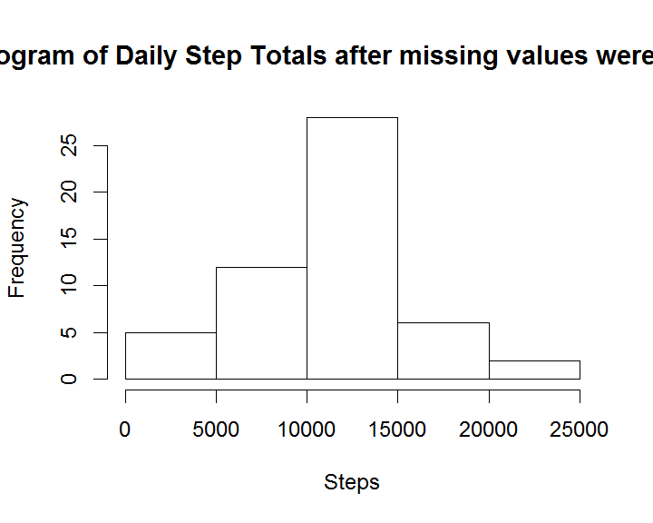

# Reproducable Research - Peer review project 1

### Synopsis
Analysis of weekend vs. weekday "quantified self" database from exercise tracking devices

### Exploritory analysis

#### Loading and processing the raw data


```r
## Loading the raw dataset 
rawData <- read.csv("activity.csv",colClasses=c("integer","character","integer"),stringsAsFactors=TRUE)

## Counting missing rows
numberOfRows<-nrow(rawData)
completeData<-rawData[complete.cases(rawData),]
numberOfRowsWithMissingData <- numberOfRows-nrow(completeData)

## Determining means & median of step daily totals with na values ignored
library("lubridate") 
dates<-levels(factor(completeData$date))
dateSteps<-c()
for (date in dates){
  dateSteps<-c(dateSteps,sum(completeData$steps[completeData$date==as.character(date)]))
}
dailyMean<-mean(dateSteps)  ## calculating mean of daily total of steps
dailyMedian<-median(dateSteps)  ## calculating median of daily total of steps
hist(dateSteps,main="Histogram of Daily Step Totals",xlab="steps")
```

 

```r
intervals<-levels(factor(completeData$interval))
intervalSteps<-c()
maxInterval<-0
maxIntervalAmount<-0
for (interval in intervals){
  aveStepsThisInterval<-mean(completeData$steps[completeData$interval==interval])
  if (aveStepsThisInterval > maxIntervalAmount){
    maxInterval<-interval
    maxIntervalAmount<-aveStepsThisInterval
  }
  intervalSteps<-c(intervalSteps,aveStepsThisInterval)
}
plot(intervalSteps~intervals,type="l",main="Daily Steps Taken",ylab="Total Number of Steps Per Day",xlab="Interval")
```

 

### Average daily activity pattern
The mean of the daily total steps is :1.0766189\times 10^{4} and the median of the daily total steps is :10765.
The interval with the hightest average number of steps is:835.

### Checking to see if there are visible differences in patterns with the omitted versus simulated values
### The missing values are simulated using the average steps from the same day of the week as the missing data

There are 2304 rows with missing data in 17568 total rows. 


```r
steps<-rawData$steps
date<-ymd(rawData$date)
day<-weekdays(date)
interval<-rawData$interval
##Create a new variable indicating whether a given date is a weekday or weekend day.
dayType<-ifelse((day=="Saturday")|(day=="Sunday"),1,0)
fitData <- data.frame(steps,date,day,dayType,interval)  
library("dplyr")
```

```
## 
## Attaching package: 'dplyr'
## 
## The following objects are masked from 'package:lubridate':
## 
##     intersect, setdiff, union
## 
## The following object is masked from 'package:stats':
## 
##     filter
## 
## The following objects are masked from 'package:base':
## 
##     intersect, setdiff, setequal, union
```

```r
fitData <- fitData %>%
##  group_by(day) %>%
  group_by(interval) %>% ## group by interval within a day of the week in order to get mean for missing information
  mutate(steps=replace(steps,is.na(steps),mean(steps,na.rm=TRUE)))

## Getting subtotals
graphFrame<- fitData %>%   
  group_by(interval,dayType) 

library(ggplot2)
qplot(interval,steps,data=graphFrame,
  color=dayType,geom="line",
  main="Number of steps per time interval, weekend and weekday",
  xlab="Interval",ylab="Average steps")
```

 

```r
hist(dateSteps,main="Histogram of Daily Step Totals after missing values were inputted",xlab="Steps")
```

 

```r
simIntervalSteps<-c()
for (interval in intervals){
  simIntervalSteps<-c(simIntervalSteps,mean(fitData$steps[fitData$interval==interval],na.rm=T))
}
par(mfrow=c(1,2))
plot(intervalSteps~intervals,type="l",main="Raw Data",ylab="Total Number of Steps Per Day",xlab="Interval (s)")
plot(simIntervalSteps~intervals,type="l",main="Simulated Data ",ylab="Total Number of Steps Per Day",xlab="Interval (s)"
)
```

 

```r
summary(rawData$steps)
```

```
##    Min. 1st Qu.  Median    Mean 3rd Qu.    Max.    NA's 
##    0.00    0.00    0.00   37.38   12.00  806.00    2304
```

```r
summary(fitData$steps)
```

```
##    Min. 1st Qu.  Median    Mean 3rd Qu.    Max. 
##    0.00    0.00    0.00   37.38   27.00  806.00
```

```r
library(ggplot2)
qplot(interval,steps,data=rawData,
  color=dayType,geom="line",
  main="Raw Number of steps per time interval, weekend and weekday",
  xlab="Interval",ylab="Average steps")
```

```
## Warning: Removed 2 rows containing missing values (geom_path).
```

 

```r
qplot(interval,steps,data=fitData,
  color=dayType,geom="line",
  main="Estimated number of steps per time interval, weekend and weekday",
  xlab="Interval",ylab="Average steps")
```

 

```r
library(lattice)
##xyplot(steps|dayType,data=fitData,main="Estimated number of steps per 5 minute time interval, weekend & weekday")
```

Neither the histogram, nor the time series graphs does not show large differences between the graph with the omitted values versus the graphs with the simulated values.  The summary report indicates an increase in the value of the 3rd Quantile.


####Plot containing a time series plot (i.e.  type = "l" ) of the 5-minute interval (x-axis) and the average number of steps taken, averaged across all weekday days or weekend days (y-axis). 
This does not show a difference between weekday and weekend activity.


```r
xyplot(x~y,
       data=fitData,
       type="l",
       groups=dayType,
       main="Daily Steps Taken",ylab="Total Number of Steps Per Day",xlab="Interval")
```

 

```r
qplot(interval,steps,data=fitData,
  color=dayType,
  geom="line",
  main="Number of steps per time interval, weekend and weekday",
  xlab="Interval",ylab="Average steps")
```

 
