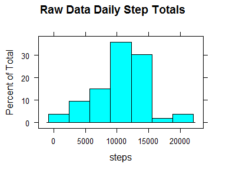

# Reproducable Research - Peer review project 1

### Synopsis
Analysis of weekend vs. weekday "quantified self" database from exercise tracking devices to determine if there is variation between weekday and weekend movement patterns.

### Exploritory analysis

#### Loading and processing the raw data


```r
## Loading the raw dataset 
rawData <- read.csv("activity.csv",colClasses=c("integer","character","integer"),stringsAsFactors=TRUE)

## Counting missing rows
numberOfRows<-nrow(rawData)
completeData<-rawData[complete.cases(rawData),]
numberOfRowsWithMissingData <- numberOfRows-nrow(completeData)

## Determining means & median of step daily totals with na values ignored
library("lubridate") 
dates<-levels(factor(completeData$date))
dateSteps<-c()
for (date in dates){
  dateSteps<-c(dateSteps,sum(completeData$steps[completeData$date==as.character(date)]))
}
dailyMean<-round(mean(dateSteps),3)  ## calculating mean of daily total of steps
dailyMedian<-round(median(dateSteps),3)  ## calculating median of daily total of steps

library("lattice")
histogram(dateSteps,main="Raw Data Daily Step Totals",xlab="steps")
```

 

```r
intervals<-levels(factor(completeData$interval))
intervalSteps<-c()
maxInterval<-0
maxIntervalAmount<-0
for (interval in intervals){
  aveStepsThisInterval<-mean(completeData$steps[completeData$interval==interval])
  if (aveStepsThisInterval > maxIntervalAmount){
    maxInterval<-interval
    maxIntervalAmount<-aveStepsThisInterval
  }
  intervalSteps<-c(intervalSteps,aveStepsThisInterval)
}
```

#### Raw Data Average daily activity pattern
The mean of the daily total steps is :10,766.19.
The median of the daily total steps is :10,765.
The interval with the hightest average number of steps is:835.


```r
plot(intervalSteps~intervals,type="l",main="Average Daily Activty Pattern",ylab="Total Number of Steps",xlab="Interval")
```

 

#### Creating an analysis dataframe


```r
steps<-rawData$steps
date<-ymd(rawData$date)
day<-weekdays(date)
interval<-rawData$interval
##Create a new variable indicating whether a given date is a weekday or weekend day.
dayType<-ifelse((day=="Saturday")|(day=="Sunday"),"Weekend","Weekday")

fitData <- data.frame(steps,date,day,dayType,interval)  
library("dplyr")
```

```
## 
## Attaching package: 'dplyr'
## 
## The following objects are masked from 'package:lubridate':
## 
##     intersect, setdiff, union
## 
## The following object is masked from 'package:stats':
## 
##     filter
## 
## The following objects are masked from 'package:base':
## 
##     intersect, setdiff, setequal, union
```

```r
fitData <- fitData %>%
  group_by(dayType,interval) %>% ## replace missing values with average steps matching that day of the week & that interval
  mutate(steps=replace(steps,is.na(steps),mean(steps,na.rm=TRUE)))
```

#### Checking for differences in data between omitted versus & simulated values

The missing values are simulated using the average steps from the same day type category and time interval as the missing data

In the raw dataset there are 2,304 rows 
with missing data in 17,568 total rows. Per interval the mean number of
steps in this dataset is 37.383
, the median 0.


```r
## Creating a histogram of the fitted daily totals
dates<-levels(factor(fitData$date))
dateSteps<-c()
for (date in dates){
  dateSteps<-c(dateSteps,sum(fitData$steps[fitData$date==ymd(date)]))
}

## Getting mean, median, & maximum information for the fitted daily totals
dailyMean<-round(mean(dateSteps),3)  ## calculating mean of daily total of steps
dailyMedian<-round(median(dateSteps),3)  ## calculating median of daily total of steps

intervals<-levels(factor(fitData$interval))
intervalSteps<-c()
maxInterval<-0
maxIntervalAmount<-0
for (interval in intervals){
  aveStepsThisInterval<-mean(fitData$steps[fitData$interval==interval])
  if (aveStepsThisInterval > maxIntervalAmount){
    maxInterval<-interval
    maxIntervalAmount<-aveStepsThisInterval
  }
  intervalSteps<-c(intervalSteps,aveStepsThisInterval)
}
```

#### Fitted Data Average daily activity pattern
The mean of the daily total steps is :10,762.05.
The median of the daily total steps is :10,571.
The interval with the hightest average number of steps is:835.


```r
histogram(dateSteps,main="Fitted Data Daily Step Totals",xlab="steps")
```

 

```r
summary(rawData$steps)
```

```
##    Min. 1st Qu.  Median    Mean 3rd Qu.    Max.    NA's 
##    0.00    0.00    0.00   37.38   12.00  806.00    2304
```

```r
summary(fitData$steps)
```

```
##    Min. 1st Qu.  Median    Mean 3rd Qu.    Max. 
##    0.00    0.00    0.00   37.37   24.00  806.00
```

Neither the histogram, nor the time series graphs does not show large differences between the histogram graph with the omitted values versus the graphs with the simulated values.  The summary report indicates an increase in the value of the 3rd Quantile.

## Comparing weekday and weekend activity patterns

####Plot containing a time series plot (i.e.  type = "l" ) of the 5-minute interval (x-axis) and the average number of steps taken, averaged across all weekday days or weekend days (y-axis). 


```r
fitDataTotals<-aggregate(steps~interval+dayType,data=fitData,mean,na.rm=TRUE)
library(ggplot2)
qplot(interval,steps,data=fitDataTotals,
  color=dayType,geom="line",
  main="Average Total Steps using Fitted Data",
  xlab="Interval",ylab="Average steps")
```

 

This graphs suggests greater activity during the mornings of the weekdays, and a greater amount of afternoon & evening activity during the weekends.

